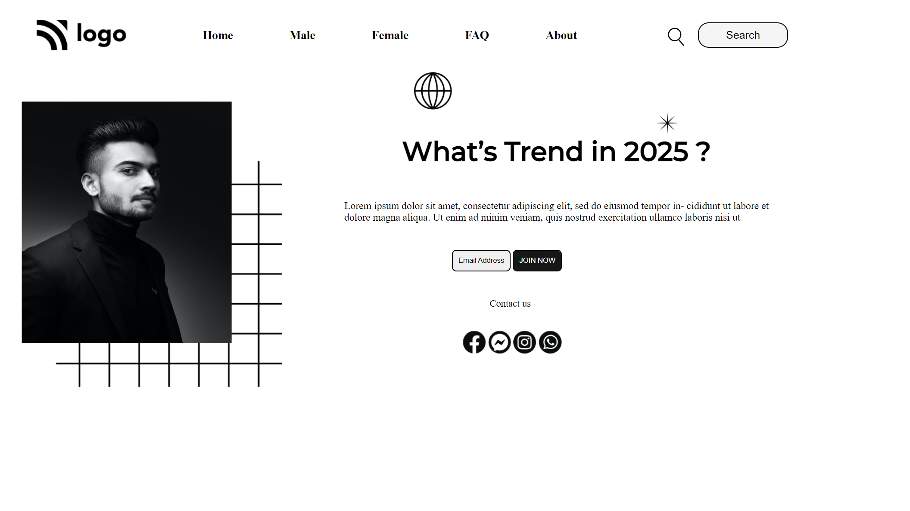

# Street Style Landing Page

My Full stack Developer Journey Begins Here. 

This is my first HTML+CSS project out of 15 projects from the assignments given by  [Hitesh Choudhary](https://hiteshchoudhary.com/)
where a HTML,imgs was given already, I need to desgin the landing page as per the mock desgin.
As it was my first hands-on web development project it took close to 8-10hrs to understand how the flow of selection and positioning icons and how to align them and much more.

This Street Style Landing Page project is all about positioning of elements. 

## Lessons Learned

HTML tags

CSS tags

CSS Selectors

## Screenshots

[Live Link](https://street-style-landing-project-1.netlify.app/)
